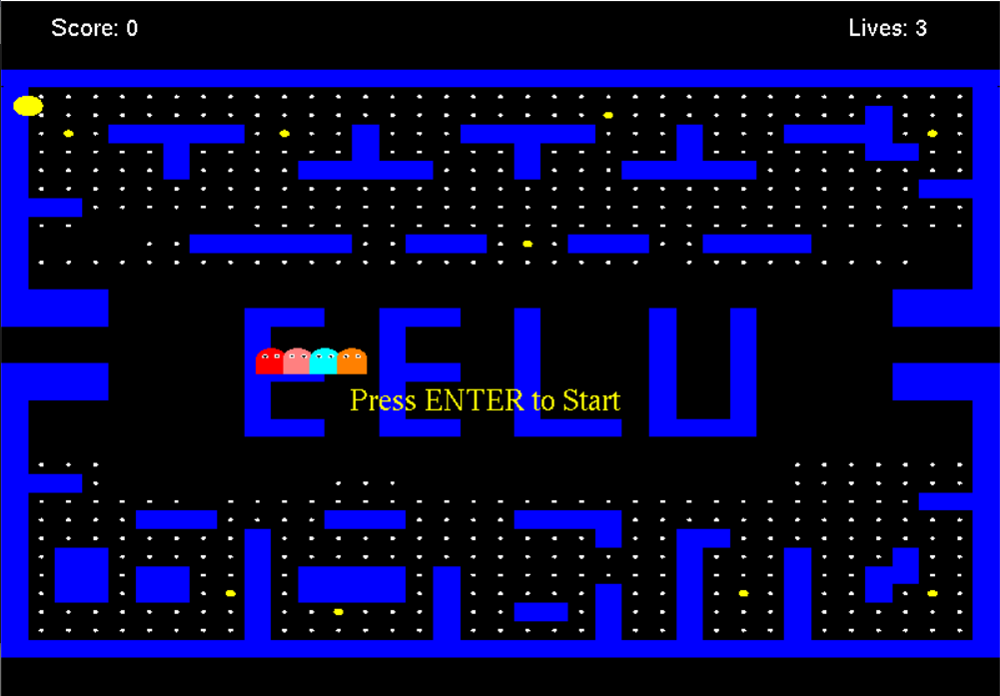
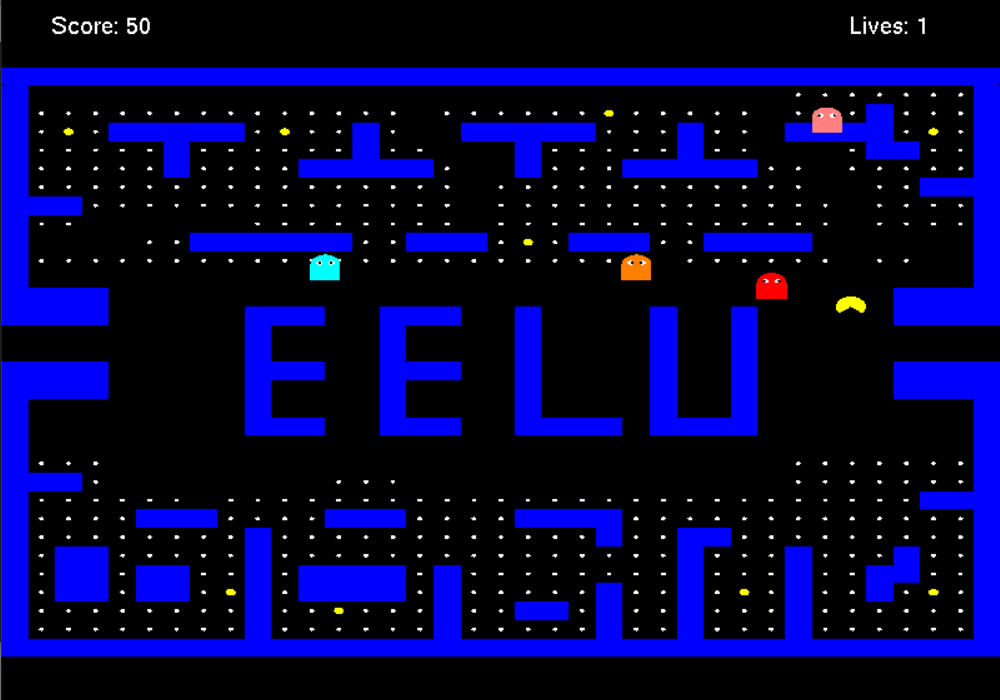
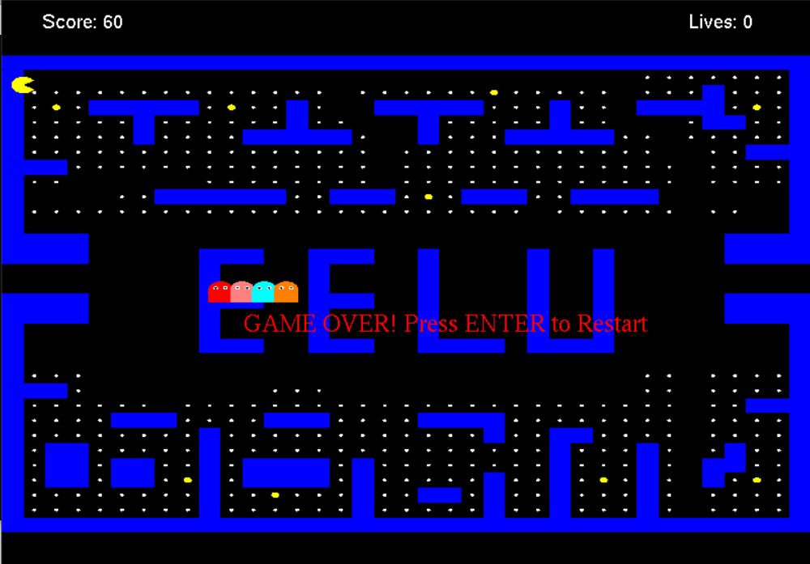

# EELU Pac-Man 🎮✨ (v1.0)

  
[](https://github.com/Xeahmed/eelu-pacman)  
[](https://www.linkedin.com/in/ahmed-refat-mohamed/)  
[](https://x.com/xeahmed2)  
[](LICENSE)  
  
  
[](https://eelu.edu.eg)

Welcome to **EELU Pac-Man**, a vibrant reimagination of the classic arcade game crafted for the **Computer Graphics** course at the **Egyptian E-Learning University (EELU) - Faculty of IT**. Built with **C++** and **OpenGL (GLUT)**, this project (v1.0, Released: July 2025) features a 37x37 maze, smart ghost AI, and fluid animations. Guide Pac-Man, gobble dots, and outwit four ghosts in this nostalgic yet cutting-edge experience! 🎉

<p align="center">
  
</p>

---

## 🚀 Features

- **Classic Gameplay**: Navigate Pac-Man to eat dots and power pellets while dodging ghosts.  
- **Intelligent Ghost AI**:  
  - :ghost: **Blinky**: Aggressive chaser (Red).  
  - :ghost: **Pinky**: Ambushes with prediction (Pink).  
  - :ghost: **Inky**: Strategic pursuit (Cyan).  
  - :ghost: **Clyde**: Toggles between chase and scatter (Orange).  
- **Dynamic Modes**: Ghosts switch between Chase, Scatter, Frightened, and Eaten.  
- **Smooth Animations**: Pac-Man’s mouth moves with a sine wave; ghosts have expressive eyes.  
- **Optimized Rendering**: Utilizes OpenGL display lists for efficient maze drawing.  
- **Tunnels**: Teleport across the maze for tactical moves.  
- **Scoring & Lives**: Track points and lives, with pause (`P`) and restart (`Enter`).  
- **Responsive Controls**: Use WASD or arrow keys for intuitive movement.

---

## 🛠️ Installation

### Prerequisites
- **C++ Compiler**: GCC, Clang, or MSVC (C++17).  
- **OpenGL**: Ensure OpenGL support on your system.  
- **GLUT**: Install FreeGLUT or OpenGL Utility Toolkit.

### Steps
1. **Clone the Repository**:  
   ```bash
   git clone https://github.com/Xeahmed/eelu-pacman.git
   cd eelu-pacman
   ```
2. **Install Dependencies**:  
   - **Ubuntu/Debian**:  
     ```bash
     sudo apt-get install freeglut3-dev
     ```
   - **macOS**:  
     ```bash
     brew install freeglut
     ```
   - **Windows**: Install FreeGLUT and configure with your IDE (e.g., Visual Studio).  
3. **Compile the Code**:  
   ```bash
   g++ source.cpp -o pacman -lGL -lGLU -lglut
   ```
4. **Run the Game**:  
   ```bash
   ./pacman
   ```

---

## 🎮 Usage

1. **Start the Game**: Press `Enter` to begin.  
2. **Controls**:  
   - **WASD** or **Arrow Keys**: Move Pac-Man (W/Up: North, S/Down: South, A/Left: West, D/Right: East).  
   - **P**: Pause/Resume.  
   - **Enter**: Restart after game over.  
   - **Esc**: Exit.  
3. **Objective**:  
   - Eat dots (`2`) for 1 point each.  
   - Grab power pellets (`3`) for 10 points to make ghosts vulnerable.  
   - Avoid ghosts in Chase/Scatter modes to save lives.

### Example
```bash
./pacman
# Press Enter, use WASD to navigate, P to pause
```

---

## 📸 Screenshots

<p align="center">
  
  
  
</p>

---

## 🎥 Demo Video

<p align="center">
  <video controls preload="auto" width="600" style="border-radius: 10px; box-shadow: 0 8px 16px rgba(0, 0, 0, 0.3);">
    <source src="screenshots/demo.mp4" type="video/mp4">
    Your browser does not support the video tag.
  </video>
</p>

---

## 🐛 Known Issues
- **Collision Edge Cases**: Rare glitches at tunnel edges.  
- **Performance**: Potential lag on low-end systems due to OpenGL.  
- **Windows Setup**: GLUT configuration may differ across IDEs.

---

## 🚧 Roadmap
- Add sound effects for eating dots and pellets.  
- Implement multi-level progression.  
- Enable custom maze designs.  
- Include a high-score leaderboard.

---

## 🤝 Contributing

Contributions are welcome! To contribute:  
1. Fork the repository.  
2. Create a branch (`git checkout -b feature/your-feature`).  
3. Commit changes (`git commit -m "Add your feature"`).  
4. Push to your branch (`git push origin feature/your-feature`).  
5. Open a Pull Request.  

See [CONTRIBUTING.md](CONTRIBUTING.md) for details.

---

## 📜 License

This project is licensed under the MIT License. See [LICENSE](LICENSE) for details.

---

## 📬 Contact

Developed by **Eng. Ahmed Refat Mohamed** for the Computer Graphics course at EELU - Faculty of IT, Sohag.  
- 📧 Email: [a.xp2121@gmail.com](mailto:a.xp2121@gmail.com)  
- 🐦 X: [@xeahmed2](https://x.com/xeahmed2)  
- 🌐 LinkedIn: [Ahmed Refat Mohamed](https://www.linkedin.com/in/ahmed-refat-mohamed/)  
- 🌐 GitHub: [Xeahmed](https://github.com/Xeahmed)

---

## 🎉 Acknowledgments

- Inspired by the iconic Pac-Man arcade game.  
- Created for the Computer Graphics course at EELU - Faculty of IT, Sohag.  
- Gratitude to the OpenGL and GLUT communities.  
- Thanks to EELU for supporting student innovation.

<p align="center">
  
</p>
